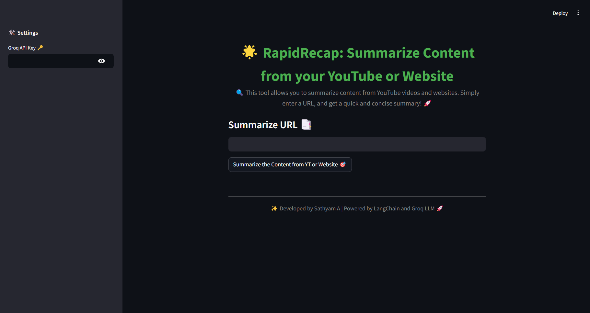

# RapidRecap 📑

## Overview
A Streamlit-based application that summarizes content from YouTube videos and websites using the Gemma-7b-It model from Groq. Easily input any URL to get quick, insightful summaries with just a click! 🚀

  <!-- Replace 'screenshot.png' with your actual image file name -->

## Table of Contents
- [Installation](#installation)
- [Usage](#usage)
- [Requirements](#requirements)
- [Acknowledgements](#acknowledgements)
- [License](#license)

## Installation

To get started, you need to create a Conda environment. Follow these steps:

1. **Create a Conda environment**:
   ```
   conda create -p venv python=3.11 -y
   ```
2. **Activate the environment**:
   ```
   conda activate langchain-summarizer
   ```   
3. Install the required packages: You can install the required packages using the `requirements.txt` file. Then, run:
   ```
   pip install -r requirements.txt
   ```
4. Add a .env file: Create a `.env` file in the root directory of your project to store your Groq API Key. Add the following line to the file:  
   ```
   GROQ_API_KEY=your_groq_api_key_here
   ```

## Usage   
1. Ensure you have your Groq API Key stored in the `.env` file.
2. Run the application:
   ```
   streamlit run app.py
   ```
3. Open your web browser and navigate to `http://localhost:8501` to access the application. 

## Acknowledgements
* **LangChain**: For providing the framework to build language model applications.
* **Groq**: For the powerful Gemma-7b-It model.
* **Streamlit**: For making it easy to create web applications in Python.
* **YouTube and Web Sources**: For the content being summarized.

## License
This project is licensed under the GNU License - see the [LICENSE](LICENSE) file for details